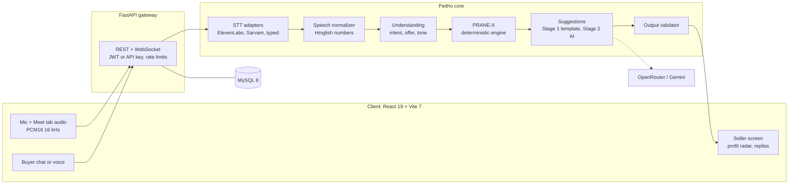

# DEFINE 4.0

The official project submission repository for **DEFINE 4.0 — The World's Realest Hackathon**.

---

# Peitho: Real-Time Conversation Copilot


## Team Information

- **Team Name**: Alt F4
- **Track**: General (PS 007: Real-Time Conversation Assistant)

## Team Members


| Name | Role | GitHub | LinkedIn |
|------|------|--------|----------|
| Abhay Parameswer R | Backend logic,flutter dev | [@abhay-7-7-7](https://github.com/abhay-7-7-7) | [Profile](https://www.linkedin.com/in/abhay-parameswer-r-190624323/) |
| Adithya Narayan V S | Backend Deterministic logic dev | [@AdithyaNarayann](https://github.com/AdithyaNarayann) | [Profile](https://www.linkedin.com/in/adithyanarayanvs/) |
| Deva Nandan M R | Backend logic,Orchestration | [@Xer0oo7](https://github.com/Xer0oo7) | [Profile](www.linkedin.com/in/deva-nandan) |
| Abhinand N L  | UI/UX | [@Abhhinand](https://github.com/Abhhinand) | [Profile](https://www.linkedin.com/in/abhinand-nl-975198294?utm_source=share_via&utm_content=profile&utm_medium=member_android) |
| Niranjan A | Frontend dev | [@Ninja007-NJ](https://github.com/Ninja007-NJ) | [Profile](https://www.linkedin.com/in/niranjan-a-b1783a30b/?isSelfProfile=true) |


---

# Project Details

## Overview

Peitho is a real-time conversation copilot that listens to a live conversation, understands the user's objective, and gives private, one-tap response suggestions and next steps while the user stays in control. Its first expert mode is negotiation: a deterministic engine (PRANE-X) decides every price and the language model only phrases the advice, so margin is protected and the AI can never promise a price the rules did not approve.

## Problem Statement

**PS 007: Real-Time Conversation Assistant.** In sales pitches, support calls, negotiations and team discussions, people have to listen, think and respond at the same time.

- **What is the problem?** Attention is split between hearing and answering. Important points are missed, replies become reactive, and decisions or next steps are forgotten. In a negotiation, one missed point or one careless concession directly costs money.
- **Who is affected?** Sales representatives, support agents, small business owners and anyone who negotiates or makes decisions live, over a call or a chat.
- **Why is it important?** Live conversations are where deals are won or lost, and nobody can compute floors, margins and buyer intent while talking.
- **Limitations of existing solutions:**
  - Meeting tools mostly transcribe and summarize after the conversation, when it is too late to change the outcome.
  - General-purpose LLM assistants can invent a discount below cost or leak internal limits, because they have no hard business constraints.
  - Generic speech-to-text misreads spoken Indian-style prices such as "dedh sau" (150) or "paune do lakh" (175000).

## Solution

Peitho does three things: **Understand. Advise. Remember.**

1. **Understand**: it transcribes the live conversation, normalizes spoken prices (Hinglish included), and extracts intent, offers and tone against the user's stated objective (in negotiation mode, the seller's price limits, mode and inventory).
2. **Advise**: it shows relevant facts on screen (profit radar, live limit check, market comparison), up to three one-tap suggested replies (HOLD, BRIDGE, CLOSE, PROBE), and a next step (COUNTER, ACCEPT, FINAL_OFFER, REJECT) with the reason behind it.
3. **Remember**: it keeps the full transcript, a round-by-round log, and the locked deal terms. The seller can email alerts for deals and margin breaches.

**Core design rule: rules decide, AI speaks.** Every number comes from PRANE-X, a pure deterministic Python engine (no I/O, no randomness; the same input always gives the same output). The LLM only phrases advice, and a validator blocks any reply containing a number or phrase the engine did not approve.

**Workflow:** capture (mic, meeting-tab audio, typed text) → speech-to-text → speech normalizer → intent and offer extraction → PRANE-X decision → Stage 1 instant template advice (under 10 ms) → Stage 2 AI-phrased upgrade (1 to 2 s) → output validator → the human decides what to say.

**Three ways to use it:**

| Mode | What it does |
|------|--------------|
| **Live Call Copilot** | Seller-facing "whisper" assistant for Google Meet. Captures the seller's mic and the buyer's tab audio as two channels and advises the seller privately. Nothing is sent to the buyer. |
| **Live Chat Copilot** | Seller-facing command center for live chat, with a profit radar, telemetry and one-click replies. |
| **Autonomous Negotiation Bot** | Buyer-facing chat and voice agent running on the same engine, for when no human is available. |

### How Peitho maps to PS 007

| PS 007 asks for | Status | How |
|-----------------|--------|-----|
| Understand the discussion | Built | Dual-channel live transcript, speech normalizer, intent and offer extraction |
| Understand the user's objective | Built | Seller's price limits, mode and inventory set at session start |
| Relevant information | Built | Profit radar, live limit check, competitive market comparison |
| Response suggestions | Built | HOLD, BRIDGE, CLOSE, PROBE cards (each under 25 words, never repeated across 3 turns) |
| Next steps | Built | Deterministic action with price and reason |
| A record of the conversation | Built | Transcript history, round log, Lock Deal |
| Individual conversations | Built | Live Call Copilot and Live Chat Copilot |
| **Group discussions** | **Roadmap** | The pipeline already runs one channel per speaker; extending it to N named participants is our next milestone. Not implemented in this submission. |
| Simple and unobtrusive | Built | Advisory only, at most 3 suggestions, nothing is sent to the other side |
| Suitable for confidential conversations | Built, with limits | See [Privacy and Confidentiality](#privacy-and-confidentiality) |

---

# Demo

### Demo Video

[Watch Project Demo](https://drive.google.com/drive/folders/1xigcN-tbZkOEwU_VARUbgWx327EvIOpI?usp=sharing)

---

# Live Project

<!-- Replace with your deployed URL. If the project is not deployed, delete the link below and keep the sentence. -->

[Visit Live Project]()

If you prefer to run it yourself, follow the [Setup Instructions](#setup-instructions). The whole system runs locally and works with zero external API keys.

---

# Technical Implementation

## Technologies Used

| Category | Technologies |
|----------|--------------|
| **Frontend** | React 19, Vite 7, Tailwind CSS, Three.js, Web Audio API (dual-stream capture) |
| **Backend** | Python 3.10+ (tested on 3.12), FastAPI, Uvicorn, WebSockets, SlowAPI rate limiting, Pydantic, structlog, Jinja2 |
| **Database** | MySQL 8+ (via aiomysql), in-memory TTL cache (cachetools) for live sessions |
| **APIs / Services** | ElevenLabs Scribe Realtime (speech-to-text), Sarvam AI Saaras v3 and Bulbul v3 (Indian-language voice), OpenRouter (LLM gateway), Google Gemini 2.5 Flash-Lite (UI translation), SerpAPI (market prices) |
| **AI / ML** | PRANE-X deterministic engine (Buyer Behavior Index, Bayesian willingness-to-pay, OLS trend and ZOPA estimation), Gemini 2.5 Flash via OpenRouter (Stage 2 phrasing only), RapidFuzz (product matching) |
| **DevOps / Deployment** | Local development with Uvicorn and Vite, `.env` configuration, pytest test suite |
| **Other Tools** | pytest, BeautifulSoup (market scraper), JWT (HS256) and bcrypt authentication, `tm_` API keys |

## System Architecture

<!-- Add your architecture diagram here -->




### How the deterministic engine (PRANE-X) works

- **Dynamic floor**: mode margin (8% or 3%) × inventory multiplier × logarithmic bulk discount, with a hard cost lock, a scarcity lock and a price-signal guard.
- **Buyer Behavior Index (0 to 100)**: rewards good-faith movement, penalizes lowballs, retrograde and stagnant offers.
- **Bayesian willingness-to-pay**: updates the belief that the buyer can pay more after every offer.
- **ZOPA and trend extrapolation**: OLS regression over recent offers projects the buyer's ceiling; no overlap for 4 rounds freezes a final offer.
- **Concession curve with a proximity gate**: concessions grow as the buyer closes the gap, and shrink when the buyer is far away.
- **Anti-exploit caps**: gap-closure cap, seller-reciprocity cap and a counter ratchet that never lets the price rise or leak budget.
- **Graduated firmness**: four levels from normal to final offer, with three redemption paths for buyers who recover.
- **Acceptance model**: a hard minimum ratio (88% of base in max-profit mode, 78% in min-loss mode) plus a marginal-utility test of whether waiting pays.

## Key Features

- **Live Call Copilot** for Google Meet: dual-channel (seller mic and buyer tab audio) real-time transcription with private, advisory-only guidance.
- **Live Chat Copilot**: profit radar, floor-boundary checks, live telemetry and one-click replies.
- **Two-stage advice**: instant deterministic template advice in under 10 ms, upgraded in place by AI-phrased suggestions within 1 to 2 seconds.
- **Deal likelihood score (0 to 100)**: explainable, with top positive and negative drivers and a score history.
- **Hinglish speech normalizer**: converts spoken prices such as "dedh sau", "dhai hazar" and "paune do lakh" into numbers, and ignores non-price numbers like durations and percentages.
- **Safety validator**: checks that every number in an AI reply comes from the engine, blocks leaks of cost, floor and margin, and strips unauthorized promises.
- **Session record**: full transcript history, round-by-round margin log, Lock Deal with recorded profit, and white-label email alerts.
- **Autonomous negotiation bot** (chat and voice) built on the same engine.
- **Business analytics**: profit and margin calculations, rule-based insights, what-if simulator and competitive market comparison.
- **Triple-fallback resilience**: every external service has a local fallback, so the system runs with zero API keys. Neo-brutalist UI with 50+ language support and RTL layouts.

### Current scope and roadmap

| Now (built) | Next (roadmap, not built) |
|-------------|---------------------------|
| 1-to-1 conversations over chat and voice | Group discussions: one channel per participant, with notes and action items |
| Negotiation as the first expert mode | Sales pitch and support call modes |
| Audio sent to the speech provider you select | On-device speech-to-text, so audio never leaves the machine |
| In-memory live sessions | Redis-backed sessions for multi-instance deployment |

## Privacy and Confidentiality

- **Decisions stay local**: prices and decisions are computed by PRANE-X on your own backend. No language model is involved in any number.
- **Hidden internals**: the buyer never sees cost, floor or margin. These values are never put into LLM prompts, and a validator rejects any reply that mentions them.
- **Audio**: audio is streamed only to the speech provider you choose (ElevenLabs or Sarvam). In `typed` mode no audio is used, and nothing leaves your backend except text sent to the optional LLM gateway.
- **Session handling**: live copilot sessions are held in server memory and can be terminated and cleaned up through `DELETE /api/v1/peitho/sessions/{id}`.
- **Access and logging**: JWT or `tm_` API-key authentication, bcrypt password hashing, rate limiting, security headers, and SHA-256 hashing of client IPs in production logs.
- **Known limits**: the autonomous bot stores its chat sessions in MySQL for the seller's dashboard, and the optional LLM and speech providers are third parties. On-device speech-to-text is on our roadmap.

---

# Setup Instructions

## Prerequisites

Make sure the following are installed before running the project:

- Python 3.10 or newer (tested on 3.12)
- Node.js 18 or newer (tested on 20 and 22)
- MySQL 8.0 or newer
- Google Chrome (needed for sharing meeting-tab audio in the Live Call Copilot)
- Optional API keys: ElevenLabs, Sarvam AI, OpenRouter, SerpAPI, Gemini. The project runs without any of them.

## Installation

### 1. Clone the Repository

```bash
git clone <repository-url>
cd DEFINE4.0-peitho
```

### 2. Create the Database

Log into MySQL and run:

```sql
CREATE DATABASE trademind CHARACTER SET utf8mb4 COLLATE utf8mb4_unicode_ci;
```

Tables and connection pools are created automatically when the backend starts.

### 3. Start the Backend

**Windows (PowerShell):**

```powershell
cd backend
python -m venv venv
.\venv\Scripts\Activate.ps1
pip install -r requirements.txt
cp .env.example .env
```

**macOS / Linux:**

```bash
cd backend
python3 -m venv venv
source venv/bin/activate
pip install -r requirements.txt
cp .env.example .env
```

Edit `backend/.env` (see [Environment Variables](#environment-variables)), then start the server:

```bash
uvicorn app.main:app --host 0.0.0.0 --port 8000 --reload
```

The API runs at `http://localhost:8000`. With `DEBUG=true`, interactive docs are at `http://localhost:8000/docs`.

### 4. Start the Frontend

Open a second terminal:

```bash
cd frontend
npm install
npm run dev
```

The app runs at `http://localhost:5173`.


## Running Tests

```bash
cd backend
pytest -v
```

Current result: **199 passed, 1 skipped** in about 15 seconds. The suite covers engine floor enforcement, the speech normalizer, the live copilot protocol, scoring, and scripted multi-turn haggling.

---

# Documentation

- [QUICKSTART.md](./QUICKSTART.md): local onboarding guide
- [ARCHITECTURE.md](./ARCHITECTURE.md): architecture notes
- [FEATURES.md](./FEATURES.md): feature checklist
- [README_main.md](./README_main.md): extended platform documentation

---

# License

This project is released under the **MIT License**. See [LICENSE](./LICENSE) for the full text.

