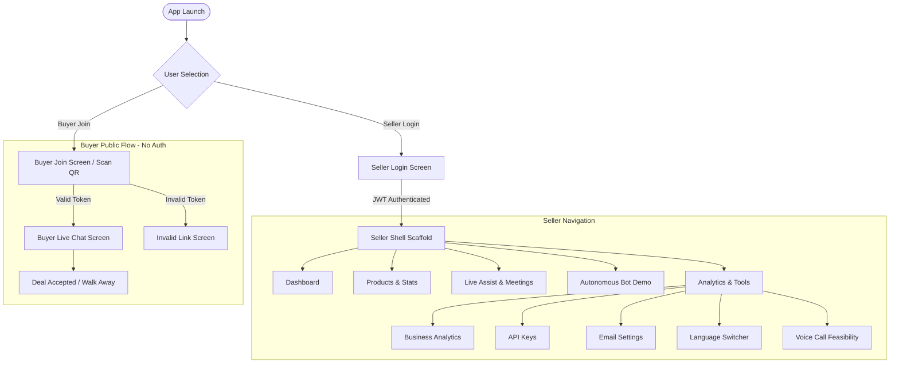
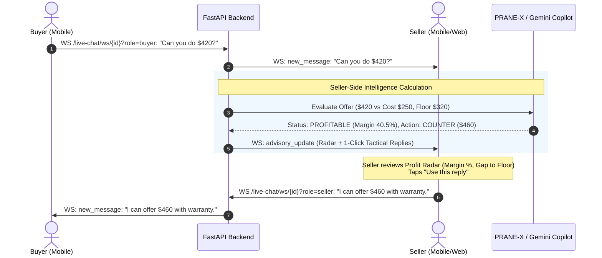

# TradeMind Mobile: Architecture, Feature Inventory & Implementation Plan
**Document**: `docs/MOBILE_PLAN.md`  
**Target Codebase**: `boldkit_flutter/` (Flutter 3.47.6 / Dart 3.13.5, Riverpod, GoRouter)  
**Backend**: TradeMind FastAPI (`peitho-final/DEFINE4.0-peitho/backend`)  
**Design System**: BoldKit Neubrutalism (Coral `#EE7171`, Teal `#3DC9B3`, Yellow `#FFD849`, 3px Solid Navy Border `#181820`, 4px Hard Shadow)

---

## Executive Summary & Architectural Vision

TradeMind Mobile is a high-performance, neubrutalist Flutter mobile application that brings the full commercial negotiation power of TradeMind / Peitho into the hands of sellers and buyers. Firebase has been completely removed from TradeMind. The mobile app integrates directly with the FastAPI backend over REST and WebSockets.

### Dual Entry Modes & Strict Security Boundary
1. **Seller Mode (Authenticated)**:
   - Secured with JWT in `flutter_secure_storage`.
   - Access to Product Management, Negotiation Dashboard, Callbacks, Live Assisted Negotiation with real-time PRANE-X Profitability Radar, Autonomous Chatbot Demo, Business Analytics & Simulation, API Key Management, SMTP Settings, and Localization.
   - Secret parameters (Unit Cost, Walk-Away Floor, Concession Strategy, Profit Margin, AI Tactical Advice) are strictly isolated to Seller views.
2. **Buyer Mode (Unauthenticated / Tokenized)**:
   - Zero login required.
   - Joins via QR code scan or deep-link paste (`/join/<token>`).
   - Tokenized public endpoints ONLY return product name, list price, quantity, and public chat transcript.
   - The buyer application **never** receives, parses, logs, or stores seller costs, floors, or AI suggestions.

---

# PHASE 0: Review & Codebase Inventory

## A. Flutter Folder Inventory (`boldkit_flutter`)

### Technical Specifications
- **Flutter Version**: `3.47.6` (Channel stable, revision `5fc346839b`)
- **Dart Version**: `3.13.5`
- **State Management**: `flutter_riverpod: ^2.5.1` (No second state library added)
- **Routing**: `go_router: ^13.2.0` with custom brutalist slide transitions (`BkMotion.pageTransition`)
- **Typography**: Google Fonts Outfit (Primary UI) and DM Mono (Monospace/Numbers/ASCII)
- **Visual Design**: Neubrutalism Design System:
  - 3px solid borders (`#181820`)
  - 4px hard offset box shadows with zero blur (`Offset(4, 4)`)
  - Sharp corners (`BorderRadius.zero` or crisp minimal radii)
  - Color Tokens:
    - Primary: Coral (`#EE7171`)
    - Secondary: Teal (`#3DC9B3`)
    - Accent: Yellow (`#FFD849`)
    - Background: Off-white Cream (`#FAFAF7`) / Dark Navy (`#181820`)
    - Card: Pure White (`#FFFFFF`) / Dark Navy Card (`#21212D`)
    - Border & Shadow: Ink Navy (`#181820`)

### Core Widget Inventory (`lib/core/widgets/`)
| Widget | File | Description |
|---|---|---|
| `BkAccordion` | `bk_accordion.dart` | Expandable disclosure panel with sharp borders and chevron rotation. |
| `BkAlert` | `bk_alert.dart` | Status alert banners (info, success, warning, destructive) with heavy border. |
| `BkAsciiShape` | `bk_ascii_shape.dart` | Retro monospace ASCII geometric glyph renderer. |
| `BkBadge` | `bk_badge.dart` | Compact status pill with uppercase bold typography and ink shadow. |
| `BkBottomSheet` | `bk_bottom_sheet.dart` | Draggable modal sheet with handle and 3px border. |
| `BkBreadcrumb` | `bk_breadcrumb.dart` | Navigation breadcrumb trail with slashed separators. |
| `BkButton` | `bk_button.dart` | Neubrutalist button with 8 variants, press translate `(2,2)`, and shadow compression. |
| `BkCanvasEffects` | `bk_canvas_effects.dart` | Halftone, grid, and scanline canvas painters. |
| `BkCard` | `bk_card.dart` | Brutalist card container with header, content, footer, and hard drop shadow. |
| `BkCarousel` | `bk_carousel.dart` | Paginated swipeable item carousel with dot indicator. |
| `BkChartWidgets` | `bk_chart_widgets.dart` | Brutalist wrappers for line charts, bar charts, and pie charts using `fl_chart`. |
| `BkCheckbox` | `bk_checkbox.dart` | Square checkbox with checkmark and hard outline. |
| `BkCollapsible` | `bk_collapsible.dart` | Animated collapsible container for expandable sections. |
| `BkCombobox` | `bk_combobox.dart` | Searchable combobox dropdown with item filtering. |
| `BkCommandPalette` | `bk_command_palette.dart` | Quick action modal launcher with search and keyboard shortcuts. |
| `BkDataTable` | `bk_data_table.dart` | Tabular data grid with sorting, row borders, and striped backgrounds. |
| `BkDialog` | `bk_dialog.dart` | Modal dialog popup with action buttons and hard shadow. |
| `BkDropdownMenu` | `bk_dropdown_menu.dart` | Context menu popup with item selections. |
| `BkInput` | `bk_input.dart` | Neubrutalist text field with floating/fixed labels and error borders. |
| `BkMarquee` | `bk_marquee.dart` | Horizontally scrolling ticker tape banner. |
| `BkMathCurve` | `bk_math_curve.dart` | Custom curve visualizer for mathematical/pricing curves. |
| `BkPagination` | `bk_pagination.dart` | Page navigation bar with prev/next buttons and page numbers. |
| `BkPopover` | `bk_popover.dart` | Floating popover anchor for contextual helpers. |
| `BkProgress` | `bk_progress.dart` | Stepped and linear progress bars with block styling. |
| `BkRadio` | `bk_radio.dart` | Neubrutalist radio option selector with concentric ink fill. |
| `BkRating` | `bk_rating.dart` | Star rating selector with half-star support. |
| `BkReveal` | `bk_reveal.dart` | Scroll-triggered entrance animations for cards and blocks. |
| `BkSelect` | `bk_select.dart` | Form select dropdown with custom option tiles. |
| `BkShadow` | `bk_shadow.dart` | Primitive shadow helper computing hard neubrutalist shadows. |
| `BkShapes` | `bk_shapes.dart` | Geometric shapes (stars, badges, zigzags) with brutalist strokes. |
| `BkSkeleton` | `bk_skeleton.dart` | Pulsing skeleton placeholder for loading states. |
| `BkSlider` | `bk_slider.dart` | Discrete and continuous slider with square thumb. |
| `BkSpinner` | `bk_spinner.dart` | Geometric block spinner indicator for loading states. |
| `BkStatCard` | `bk_stat_card.dart` | Metric card with big typography, trend indicator, and accent borders. |
| `BkStepper` | `bk_stepper.dart` | Multi-step progress indicator for linear onboarding flows. |
| `BkSticker` | `bk_sticker.dart` | Angled retro decorative sticker badge. |
| `BkSwitch` | `bk_switch.dart` | Neubrutalist toggle switch with rectangular slide block. |
| `BkTabs` | `bk_tabs.dart` | Segmented tab bar with active background fill and ink borders. |
| `BkTagInput` | `bk_tag_input.dart` | Multi-tag input field with removable chips. |
| `BkTimeline` | `bk_timeline.dart` | Vertical timeline with bullet nodes and connector tracks. |
| `BkToast` | `bk_toast.dart` | Toast notification overlay with auto-dismissal. |
| `BkTooltip` | `bk_tooltip.dart` | Brutalist hover/long-press tooltip bubble. |
| `BkTreeView` | `bk_tree_view.dart` | Hierarchical collapsible tree viewer. |

### Existing Screen Inventory (`lib/features/`)
| Screen | Path | Description |
|---|---|---|
| `HomeScreen` | `features/home/home_screen.dart` | Library catalog home displaying design tokens and components. |
| `ComponentsScreen` | `features/components/components_screen.dart` | Grid of all available BoldKit UI components. |
| `ComponentDetailScreen` | `features/components/component_detail_screen.dart` | Interactive component preview with code and controls. |
| `ChartsScreen` | `features/charts/charts_screen.dart` | Showcase of fl_chart line, bar, pie, and radar graphs. |
| `ShapesScreen` | `features/shapes/shapes_screen.dart` | Gallery of neubrutalist geometric shapes and badges. |
| `ShapeBuilderScreen` | `features/shapes/shape_builder_screen.dart` | Interactive tool to customize and export brutalist shapes. |
| `AsciiEffectsScreen` | `features/ascii_effects/ascii_effects_screen.dart` | Monospace ASCII art effects and animations. |
| `ThemeBuilderScreen` | `features/theme_builder/theme_builder_screen.dart` | Live theme token editor for palette and borders. |
| `SettingsAboutScreen` | `features/settings/settings_about_screen.dart` | App settings, dark mode switch, and library credits. |
| `LoginScreen` | `features/blocks/auth/login_screen.dart` | Pre-built neubrutalist login form UI. |
| `SignUpScreen` | `features/blocks/auth/signup_screen.dart` | Pre-built registration form UI with password fields. |
| `ForgotPasswordScreen` | `features/blocks/auth/forgot_password_screen.dart` | Email recovery request block. |
| `OtpScreen` | `features/blocks/auth/otp_screen.dart` | 6-digit pin code verification input. |
| `Error404Screen` | `features/blocks/error/error_404_screen.dart` | Page not found error display with home action. |
| `Error500Screen` | `features/blocks/error/error_500_screen.dart` | Server error display with retry button. |
| `MaintenanceScreen` | `features/blocks/error/maintenance_screen.dart` | Scheduled downtime notice banner. |
| `TestimonialsScreen` | `features/blocks/marketing/testimonials_screen.dart` | Customer review card carousel. |
| `PricingScreen` | `features/blocks/marketing/pricing_screen.dart` | Multi-tier subscription comparison cards. |
| `TeamScreen` | `features/blocks/marketing/team_screen.dart` | Team member profile cards with avatars and roles. |
| `FaqScreen` | `features/blocks/marketing/faq_screen.dart` | Frequently asked questions accordion. |
| `ContactScreen` | `features/blocks/marketing/contact_screen.dart` | Contact us feedback form. |
| `BlocksSettingsScreen` | `features/blocks/settings/settings_screen.dart` | Profile and notification settings template. |
| `OnboardingScreen` | `features/blocks/onboarding/onboarding_screen.dart` | 3-step carousel onboarding walkthrough. |
| `InvoiceScreen` | `features/blocks/invoice/invoice_screen.dart` | Receipt / invoice detail breakdown with items and total. |

---

## B. TradeMind Feature & Endpoint Inventory (`peitho-final/DEFINE4.0-peitho`)

### 1. Authentication
- **Endpoints**:
  - `POST /api/v1/auth/register`: `{ full_name, email, password }` -> returns `{ token, user: { id, full_name, email } }`
  - `POST /api/v1/auth/login`: `{ email, password }` -> returns `{ token, user: { id, full_name, email } }`
  - `GET /api/v1/auth/me`: Requires Bearer JWT -> returns `{ id, full_name, email }`
- **Security**: In-memory rate limiting, 5-attempt lockout (15 min window), bcrypt hashing, 1-hour JWT expiration.
- **Web App**: `src/pages/Login.jsx`, `src/pages/Register.jsx`

### 2. Product Catalog Management
- **Endpoints**:
  - `GET /api/v1/products`: Requires JWT -> returns array of `ProductOut` (`id`, `name`, `base_price`, `cost_price`, `min_acceptable_price`, `max_loss_percent`, `mode`, `max_rounds`, `category`, `status`, `stats`)
  - `POST /api/v1/products`: Requires JWT -> creates product
  - `PUT /api/v1/products/{id}`: Requires JWT -> updates product attributes
  - `DELETE /api/v1/products/{id}`: Requires JWT -> deletes product
  - `POST /api/v1/products/import`: Requires JWT -> parses CSV text with columns `name, basePrice, costPrice, category`
  - `GET /api/v1/products/{id}/stats`: Requires JWT -> computes live product stats from MySQL `chat_sessions`
  - `GET /api/v1/products/{id}/market-comparison`: Public / Optional JWT -> returns competitor pricing, market avg, discount vs market
- **Web App**: `src/pages/ProductCatalog.jsx`, `src/lib/productStore.js`

### 3. Negotiation Dashboard
- **Endpoints**:
  - `GET /api/v1/chat-sessions/dashboard/summary`: Requires JWT -> aggregate metrics (`total`, `accepted`, `rejected`, `active`, `expired`, `walked_away`, `total_revenue`, `avg_deal_price`, `best_deal`, `avg_rounds`), plus last 20 closed sessions and active sessions.
  - `GET /api/v1/chat-sessions`: Requires JWT -> returns all sessions for user.
  - `GET /api/v1/chat-sessions/{id}`: Requires JWT -> session details + messages array + callback request.
  - `GET /api/v1/chat-sessions/{id}/export`: Requires JWT -> full session transcript.
- **Web App**: `src/pages/NegotiationDashboard.jsx` (Status filters: all, accepted, rejected, active, expired, walked away; live search; CSV/JSON export; chat viewer modal).

### 4. Callback Requests
- **Endpoints**:
  - `GET /api/v1/chat-sessions/callback-requests`: Requires JWT -> returns all callback requests for seller.
  - `POST /api/v1/chat-sessions/callback-request`: Public / JWT -> saves callback request with phone number and final price.
- **Web App**: Callback modal in `NegotiationDashboard.jsx`.

### 5. Autonomous Buyer Chatbot Demo
- **Endpoints**:
  - `POST /api/v1/negotiate/sessions`: Stateless / In-memory session creation.
  - `POST /api/v1/negotiate/sessions/{id}/turns`: Submits buyer offer `{ offered_price, message, offered_quantity }` -> returns engine decision (`accept`, `counter`, `reject`, `final_offer`, `terminate`), counter price, and conversational explanation.
  - `POST /api/v1/negotiate/sessions/{id}/chat`: Sends free-text query with LLM intent extraction.
  - `GET /api/v1/negotiate/sessions/{id}`: Retrieves state.
  - `GET /api/v1/negotiate/sessions/{id}/analytics`: Negotiation metrics (BBI, concession history).
  - `GET /api/v1/negotiate/health`: Health status.
- **MySQL Synchronization**:
  - `POST /api/v1/chat-sessions`: Initializes session in MySQL.
  - `POST /api/v1/chat-sessions/{id}/messages`: Saves each turn.
  - `PUT /api/v1/chat-sessions/{id}/close`: Closes session and triggers deal-outcome email.
- **Web App**: `src/test-chat/src/Chat.jsx`, `src/test-chat/src/api.js`.

### 6. Live Chat & Seller Assist (Dual-Role Real-Time Negotiation)
- **Endpoints**:
  - `GET /api/v1/peitho/live-chat/network-info`: Returns LAN IP, frontend/backend ports.
  - `POST /api/v1/peitho/live-chat/start`: Initializes session, returns `session_id`, `buyer_link`.
  - `GET /api/v1/peitho/live-chat/{session_id}?role=buyer`: Sanitized public info (product name, base price, quantity, messages, seller online).
  - `GET /api/v1/peitho/live-chat/{session_id}?role=seller`: Full seller info (cost, floor, margins, PRANE-X state, last advisory).
  - `WebSocket /api/v1/peitho/live-chat/ws/{session_id}?role=seller|buyer`:
    - Frame types: `chat_message`, `new_message`, `typing`, `presence`, `advisory_update`, `recommendation_upgrade`, `seller_update`.
- **Seller Assist Panel Features**:
  - Profitability Radar: Unit cost, floor price, unit profit, margin %, total deal value, deal profit, status badge (`NO_OFFER_YET`, `PROFITABLE`, `ACCEPTABLE`, `CONTROLLED_LOSS`, `BELOW_FLOOR_VIOLATION`), severity banner.
  - PRANE-X Telemetry: Round, BBI (Buyer Bargaining Index), P(High WTP), remaining concession budget, firmness level (0-3).
  - Tactical Replies: 1-click suggested replies generated in two stages (instant template + async AI upgrade).
- **Web App**: `src/peitho/PeithoPage.jsx`, `src/peitho/LiveChatSeller.jsx`, `src/peitho/BuyerChatPage.jsx`.

### 7. Peitho Meet Call Assistant
- **Endpoints**:
  - `POST /api/v1/peitho/start`: Initializes call session.
  - `GET /api/v1/peitho/health`: STT status (`typed` / `elevenlabs`).
  - `WebSocket /api/v1/peitho/ws/{session_id}`: Audio / typed dual-channel streaming (Seller Mic + Buyer Google Meet tab audio).
- **Web App**: `src/peitho/PeithoPage.jsx`, `src/peitho/usePeithoCall.js`.

### 8. Voice Call (Sarvam AI)
- **Endpoints**:
  - `GET /api/v1/voice/health`: Checks `sarvam_api_key`.
  - `GET /api/v1/voice/validate/{session_id}`: Checks session before calling.
  - `WebSocket /api/v1/voice/ws/{session_id}?token=...`: Bidirectional PCM audio streaming with Sarvam Saaras STT and Bulbul TTS.
- **Web App**: `src/call-feature/VoiceCall.jsx`, `src/call-feature/useVoiceCall.js`.

### 9. Business Analytics & Competitive Intelligence
- **Endpoints**:
  - `POST /api/v1/analytics/calculate`: Computes revenue projections, margin curve, volume elasticity, break-even.
  - `POST /api/v1/analytics/simulate`: What-if simulation under varying discount structures.
  - `POST /api/v1/analytics/competitive-analysis`: Scrapes competitors, normalizes pricing, computes price position vs market, outputs tactical recommendations.
  - `GET /api/v1/analytics/health`: Analytics engine status.
- **Web App**: `src/pages/BusinessAnalytics.jsx`.

### 10. API Key Management
- **Endpoints**:
  - `POST /api/v1/api-keys`: Creates key prefixed with `tm_`.
  - `GET /api/v1/api-keys`: Lists masked keys (`tm_•••••••abcd`).
  - `DELETE /api/v1/api-keys/{id}`: Revokes key.
- **Web App**: `src/pages/ApiAccess.jsx`, `src/pages/ApiReference.jsx`.

### 11. Email / SMTP Settings
- **Endpoints**:
  - `GET /api/v1/email/settings`: Retrieves SMTP settings.
  - `PUT /api/v1/email/settings`: Updates host, port, credentials, notification triggers.
  - `POST /api/v1/email/test`: Sends a test email.
- **Web App**: `src/pages/EmailSettings.jsx`.

### 12. Internationalization (i18n) & RTL
- **Endpoints**:
  - `POST /api/v1/translate`: Gemini translation proxy keeping API keys secure on backend.
- **Static Languages**: English (`en`), Hindi (`hi`).
- **Dynamic Languages**: 50+ languages with RTL support for Arabic, Hebrew, Persian, Urdu.
- **Web App**: `src/context/I18nContext.jsx`, `src/components/LanguageModal.jsx`, `src/lib/i18n/index.js`.

### 13. Dead / Leftover SayLess Web3 Code (DROP CLASSIFICATION)
- **Dead Pages**:
  - `ReporterDashboard.jsx` (whistleblower report stats, ETH staking, wallet connection).
  - `ReportSubmission.jsx` (encrypted report submission).
  - `SilentReportComposer.jsx` (steganographic audio recording).
  - `ReputationDashboard.jsx` (jury reputation tokens).
- **Proof of Dead Status**:
  1. The backend has **zero** endpoints matching `/api/report`, `/api/authority/*`, `/api/reporter/*`, or `/api/jury/*`.
  2. The React `Navbar.jsx` completely removed these links and reassigned `/wallet` to `ApiReference.jsx`, `/authority` to `BusinessAnalytics.jsx`, and `/jury` to `NegotiationDashboard.jsx`.
  3. These are remnants of an earlier Web3 project ("SayLess") and have no commercial relevance to TradeMind / Peitho.
- **Verdict**: **DROPPED** with full proof. Will NOT be built in Flutter.

---

## C. Live Chat Transport Review & Gap Analysis

### Current Working Mechanism
- **Transport**: FastAPI WebSockets at `/api/v1/peitho/live-chat/ws/{session_id}`.
- **Message Format**: JSON packets:
  ```json
  {"type": "chat_message", "text": "Can you do $450?"}
  ```
- **State Serialization**:
  - Server maintains `LiveChatSession` in `live_chat_store.py`.
  - On connection, `init` frame sends history and configuration.
  - For `role=buyer`, `init` and `GET /{session_id}` sanitize out:
    - `cost_price`
    - `min_floor`
    - `mode`
    - `profitability`
    - `advisory`
    - `metrics`

### Identified Gaps & Required Additive Backend Enhancements (Phase 5)
1. **HTTP Message Fallback (`POST /api/v1/peitho/live-chat/{session_id}/message`)**:
   - If WebSocket connection drops or firewalls block WS, buyer/seller need a REST path to transmit messages.
   - Enforce 1000 character maximum and rate limiting.
2. **Room Termination Endpoint (`POST /api/v1/peitho/live-chat/{session_id}/end`)**:
   - Seller-only authenticated endpoint to close the room and notify connected buyers.
3. **Room Expiry / Inactive Validation**:
   - Return 410 Gone / Expired state if a session is inactive or older than TTL.

---

## D. Mobile Gap Analysis & Prerequisites

1. **Deep Links**: Android `intent-filter` for `http`/`https` scheme with pathPrefix `/join` and `/buyer`, plus custom scheme `trademind://join/`.
2. **QR Code Scanning**: Integration of `mobile_scanner` with runtime camera permission handling and fallback to paste text input.
3. **Cleartext Traffic**: Android `network_security_config.xml` allowing cleartext `http://` for local IPs (`10.0.2.2`, `127.0.0.1`, LAN `192.168.x.x`, `10.x.x.x`) in debug builds only.
4. **CORS / Allowed Origins**: Mobile apps make direct socket and HTTP calls (not subject to browser CORS), but web / tunnel hosts need inclusion in backend `allowed_origins`.
5. **Human Prerequisites**:
   - Live microphone access on physical device for Sarvam Voice Call.
   - Real Sarvam AI API key for STT/TTS streaming.
   - Local MySQL80 service start for persistent database writes (auth/products/history).

---

# PHASE 1: Plan & Architecture

## 1. Feature Coverage Matrix (TradeMind -> Mobile)

| TradeMind Feature | Mobile Screen(s) | Endpoints | Status | Rationale |
|---|---|---|---|---|
| **Seller Auth** | `SellerLoginScreen`, `SellerRegisterScreen` | `POST /api/v1/auth/login`, `POST /api/v1/auth/register`, `GET /api/v1/auth/me` | **KEEP** | Essential entry point for sellers |
| **Product Catalog** | `ProductsListScreen`, `ProductFormScreen`, `ProductStatsScreen`, `CsvImportDialog` | `GET/POST/PUT/DELETE /api/v1/products`, `/import`, `/{id}/stats` | **KEEP** | Core inventory & pricing boundaries |
| **Negotiation Dashboard** | `DashboardScreen`, `SessionViewerModal`, `ExportSheet` | `GET /api/v1/chat-sessions/dashboard/summary`, `GET /{id}/export` | **KEEP** | Commercial analytics and history |
| **Callback Requests** | `CallbacksScreen` | `GET /api/v1/chat-sessions/callback-requests` | **KEEP** | Deal leads and customer follow-up |
| **Meetings & Live Chat** | `MeetingScheduleScreen`, `SellerLiveChatScreen`, `AssistBottomSheet` | `POST /api/v1/peitho/live-chat/start`, `WS .../live-chat/ws/{id}` | **KEEP** | Core value proposition: AI Copilot |
| **Autonomous Chatbot Demo** | `AutonomousChatScreen` | `POST /api/v1/negotiate/sessions`, `/turns`, `/chat`, `/analytics` | **KEEP** | Standalone buyer bot simulation |
| **Business Analytics** | `BusinessAnalyticsScreen`, `WhatIfSimulatorSheet` | `POST /api/v1/analytics/calculate`, `/simulate`, `/competitive-analysis` | **KEEP** | Financial modeling and margin curves |
| **API Keys Management** | `ApiKeysScreen`, `CreateKeyDialog` | `GET/POST/DELETE /api/v1/api-keys` | **KEEP** | Programmatic access control |
| **Email / SMTP Settings** | `EmailSettingsScreen` | `GET/PUT /api/v1/email/settings`, `POST /api/v1/email/test` | **KEEP** | Deal notifications & SMTP setup |
| **Buyer App (Public)** | `BuyerJoinScreen`, `BuyerChatScreen` | `GET /api/v1/peitho/live-chat/{id}`, `WS .../live-chat/ws/{id}` | **KEEP** | Zero-login cross-device negotiation |
| **i18n & Localization** | `LanguageSwitcherModal` | `POST /api/v1/translate` (Server-side Gemini proxy) | **KEEP** | 50+ languages with RTL support |
| **Sarvam Voice Call** | `VoiceCallScreen` | `GET /api/v1/voice/validate/{id}`, `WS .../voice/ws/{id}` | **ADAPT** | Requires live Sarvam key; marked NEEDS HUMAN |
| **Peitho Meet Audio Capture** | `PeithoMeetScreen` | `POST /api/v1/peitho/start`, `WS .../peitho/ws/{id}` | **ADAPT** | Mobile cannot capture desktop browser tab audio; adapted for live typed/mic speech |
| **SayLess Web3 Whistleblower** | N/A | `/api/report`, `/api/jury/*`, `/api/reporter/*` | **DROP** | Dead legacy code with no backend routes |

---

## 2. Navigation Architecture



---

## 3. Live Chat & Seller Assist Flow



---

## 4. Confidentiality & Security Boundary

| Data Attribute | Visible to Seller? | Visible to Buyer? | Enforcement Location |
|---|---|---|---|
| **Product Name & Listed Price** | YES | YES | Public Token Validation |
| **Cost Price** | YES | **NEVER** | Backend Route Filter (`role == "buyer"` strips it) |
| **Minimum Survival Floor** | YES | **NEVER** | Advisory Engine Memory Only |
| **Negotiation Mode (`MAX_PROFIT`)** | YES | **NEVER** | Filtered from Buyer Serializer |
| **Unit Profit & Margin %** | YES | **NEVER** | Filtered from Buyer Serializer |
| **PRANE-X Tactical Suggestions** | YES | **NEVER** | Streamed strictly to `seller_sockets` |
| **Seller JWT** | YES | **NEVER** | Buyer App has zero auth dependencies |

---

## 5. Backend Reachability & Network Configuration

- **Android Emulator**: `http://10.0.2.2:8000`
- **Real Mobile Device on Local Wi-Fi**: `http://<LAPTOP_LAN_IP>:8000` (e.g. `192.168.1.15:8000`)
- **Remote / Cloudflare Tunnel**: `https://<tunnel-subdomain>.trycloudflare.com`
- **Runtime Base URL Configuration**: An accessible configuration sheet on the Login and Join screens allows testing against localhost, LAN IP, or tunnel URLs without recompiling.
- **Android Cleartext Policy (`android/app/src/debug/res/xml/network_security_config.xml`)**:
  Allows non-HTTPS connections only in debug builds.

---

## 6. Implementation Task List & Phase Breakdown

### Phase 2: Foundation
- [ ] Add runtime dependencies (`flutter_secure_storage`, `http`, `web_socket_channel`, `qr_flutter`, `mobile_scanner`).
- [ ] Android network security config & intent filters.
- [ ] Config management & runtime editable Base URL provider.
- [ ] Secure Storage & Seller JWT Interceptor.
- [ ] Robust Deep Link Parser supporting full URLs, custom schemes, and bare tokens (with 15+ unit tests).
- [ ] Currency Formatter & Number utility.
- [ ] Shared Loading, Empty, Error, and Offline neubrutalist widgets.
- [ ] i18n localization foundation with English, Hindi, and RTL handling.

### Phase 3: Seller Features
- [ ] Seller Auth: Register, Login, Session restore, Logout.
- [ ] Product Catalog: CRUD, CSV import dialog, live product stats.
- [ ] Dashboard: Metrics cards, session filters, search, full chat viewer modal, export formatters.
- [ ] Callbacks & Meetings: Callbacks list with status updates; meeting scheduler with QR share.
- [ ] Live Chat Seller with Draggable / Tabbed Assist Panel (Profitability Radar, Loss Warning Banner, PRANE-X Telemetry, Suggested Replies with "Use Reply" composer autofill).
- [ ] Autonomous Chatbot Demo: Interactive multi-turn negotiation with PRANE-X engine.
- [ ] Business Analytics: Calculate, simulate what-if, charts, and competitive intelligence.
- [ ] API Key Management: Generate, copy, revoke.
- [ ] Email Settings: View, update SMTP, test email trigger.
- [ ] Voice Call Assessment & Feasibility Screen.

### Phase 4: Buyer Experience
- [ ] Buyer Join: QR camera scan (`mobile_scanner`), link paste, and name prompt.
- [ ] Buyer Chat Screen: Bubble layout, auto-scroll, optimistic send, reconnecting indicator, 1000-char limit, room closed states.
- [ ] Total isolation from seller client and tokens.

### Phase 5: Additive Backend Enhancements
- [ ] Add `POST /api/v1/peitho/live-chat/{session_id}/message` (HTTP fallback send).
- [ ] Add `POST /api/v1/peitho/live-chat/{session_id}/end` (Seller end room).
- [ ] Character length enforcement & rate limiting.
- [ ] Verification with pytest unit tests.

### Phase 6: Verification & Final Report
- [ ] `flutter analyze` clean.
- [ ] `flutter test` passing.
- [ ] Automated and manual verification tables.
