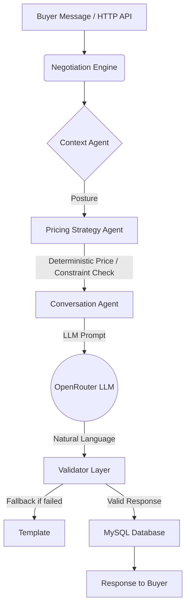

# TradeMind Project Audit & Extension Feasibility

**Date:** October 9, 2026
**Target:** TradeMind Multi-Agent Negotiation Engine
**Objective:** Assess codebase for extending into a real-time, multi-speaker "conversation copilot."

---

## 1. Tech Stack & Structure
* **Backend**: Python 3.10+, FastAPI 0.128, Uvicorn.
* **Frontend**: React 19.2, Vite 7.2, React Router 6.28, Tailwind CSS 3.4, Radix UI.
* **Database / ORM**: MySQL 8+ with raw SQL and `aiomysql` (no heavyweight ORM).
* **Task Queues**: NOT PRESENT (Celery planned for Phase 2).
* **Package Managers**: `pip` (via `requirements.txt`) and `npm`.

**Annotated Directory Tree:**
```text
TradeMind/
├── backend/
│   ├── app/
│   │   ├── agents/          # Context, Pricing, and Conversation agents
│   │   ├── api/v1/          # FastAPI route handlers
│   │   ├── core/            # engine.py (orchestration), config.py, session.py
│   │   ├── infrastructure/  # MySQL connections, OpenRouter LLM client, cache
│   │   ├── models/          # schemas.py (Pydantic models), enums.py
│   │   └── services/        # Email SMTP delivery, LLM validator
│   └── tests/               # Pytest unit and integration tests
└── frontend/
    ├── src/
    │   ├── components/      # UI components (NeoButton, Layout, ui/)
    │   ├── context/         # I18nContext, SessionContext
    │   ├── lib/             # api.js (Axios), geminiTranslate.js, encryption.js
    │   └── pages/           # React views (NegotiationDashboard, ProductCatalog, etc.)
```

**Running Locally:**
* **Backend**: `python -m venv env`, `pip install -r requirements.txt`, `uvicorn app.main:app --reload`.
* **Frontend**: `npm install`, `npm run dev`.
* **Required Services**: MySQL instance.
* **Env Vars:** `ENV`, `DEBUG`, `MYSQL_HOST`, `MYSQL_PORT`, `MYSQL_USER`, `MYSQL_PASSWORD`, `MYSQL_DB`, `JWT_SECRET`, `OPENROUTER_API_KEY`, `VITE_API_URL` (frontend).

---

## 2. Architecture & Data Flow

**Request Lifecycle (One Negotiation Round):**
1. HTTP `POST` to `/api/v1/negotiate/sessions/{id}/turns`.
2. Input validated via Pydantic (`NegotiationTurnRequest`).
3. Handed to `NegotiationEngine.process_turn` (`backend/app/core/engine.py`).
4. Checks session termination limits.
5. Passes buyer's offer to `PricingStrategyAgent` for a deterministic decision (ACCEPT/COUNTER/REJECT).
6. Updates session state.
7. Calls `PricingStrategyAgent.verbalize()` or `ConversationAgent.generate_response()` (calls LLM via OpenRouter) for a natural language reply.
8. Persists chat turn to MySQL (`chat_messages`).
9. Returns `NegotiationTurnResponse` JSON.

**Component Diagram:**


---

## 3. Agents & Orchestration (Deep Dive)

**Agents:**
* **Context Analysis Agent** (`app/agents/context_agent.py`): Determines strategic posture based on `InventoryContext` and `StrategicControls`. (LLM + Heuristics).
* **Pricing Strategy Agent** (`app/agents/pricing_agent.py`): Purely **deterministic**. Takes `BuyerOffer`, `ProductData`, and posture. Outputs `PricingDecision`. Validates floors and margins. No LLM randomness.
* **Conversation Agent** (`app/agents/conversation_agent.py`): Takes the pricing decision and generates a response. (LLM + Template Fallback).

**Orchestration:**
* Managed by `NegotiationEngine` (`app/core/engine.py`). State is cached in-memory (`cachetools.TTLCache` in `session.py`) and persisted to MySQL. 
* Operating modes (`MAX_PROFIT`, `MIN_LOSS`) are explicitly hardcoded into the deterministic math of `pricing_agent.py`. Generalizing these into arbitrary "objectives" for a copilot would require entirely rewriting this agent, as it currently only understands unit economics.

**Validation Layer:**
* The LLM Output Validation operates strictly as a "price-check" layer (regexes preventing invented prices). It is **not** currently reusable for non-pricing outputs (e.g., general intent classification or safety redaction).

---

## 4. LLM Integration
* **Provider**: OpenRouter (primarily routing to Gemini 2.0 Flash, GPT-4, Claude).
* **Location**: `backend/app/infrastructure/llm/openai_client.py`. Prompts are stored in `prompt_templates.py` (Jinja2 templates).
* **Constraints**: 10-second timeout. Hard fallbacks to rule-based heuristics if the LLM times out or errors.
* **Streaming**: NOT PRESENT. The architecture relies on complete Pydantic validations, making streaming unsupported.
* **Cost Controls**: None explicit beyond API rate limiting.

---

## 5. Data Model
* **Tables**: `users`, `products`, `chat_sessions`, `chat_messages`, `api_keys`, `email_settings`. (Based on queries in `QUICKSTART.md` and codebase references).
* **Message Storage**: `chat_messages` stores `session_id`, `round_number`, `user_message`, `bot_reply`, `decision`.
* **Multi-speaker Support**: **No**. The schema tightly couples messages as pairs (`user_message` vs `bot_reply`) per round, making 3+ participant diarization impossible without a schema rewrite.
* **Privacy**: Mentions of `TweetNaCl` for client-side PII encryption (`lib/encryption.js`), but raw chat messages are passed to the LLM and saved to DB. No auto-deletion or on-device local mode.

---

## 6. API Surface
* **Auth**: `/api/v1/auth/login`, `/api/v1/auth/register` (JWT based).
* **Negotiation**: `/api/v1/negotiate/sessions`, `/api/v1/negotiate/sessions/{id}/turns`.
* **Products**: `/api/v1/products` (CRUD).
* **Real-time endpoints (WebSockets / SSE)**: **NOT PRESENT**.

---

## 7. Auth, Security & Privacy
* **Flows**: Dual authentication accepting both JWT (UI) and `tm_` API keys (Programmatic).
* **Rate Limiting**: Used via SlowAPI (e.g., 20/min for sessions, 60/min generic).
* **Logging**: Uses `structlog`. Chat messages are processed and potentially logged during LLM payload creation. PII redaction before logging/LLM-transit is absent.
* **Gaps for Confidentiality**: Relies on cloud LLMs (OpenRouter). No local-only LLM support, no PII scrubbing pipeline, and sessions are retained until manually purged.

---

## 8. Frontend
* **Framework**: React 19.2 + Vite + Tailwind. Routing via `react-router-dom`.
* **Components**: 
  * `NegotiationDashboard.jsx`: Live session tracker and chat interface.
  * `ProductCatalog.jsx`: Product CRUD grid.
  * `BusinessAnalytics.jsx`: Revenue calculator and insights.
* **Real-Time View**: Relies entirely on **Polling**. `NegotiationDashboard.jsx` uses `setInterval(() => fetchDashboard(true), 30000)` (every 30s) to update. No WebSockets or SSE exist.
* **i18n**: Gemini API (`2.5-flash-lite`) used for live translation (`geminiTranslate.js`), with static JSON fallbacks.

---

## 9. Other Modules
* **Business Analytics**: Found under `backend/app/analytics/`. Performs mathematical calculations on deals and generates severity-graded insights.
* **Competitive Intelligence**: Exists as an "isolated plugin" (`backend/app/analytics/competitive_intelligence`), likely interacting via abstract classes or separated routers.
* **Email Service**: Async `smtplib` wrapper in `services/email_service.py` to send HTML templates without blocking the main event loop.

---

## 10. Quality & Readiness
* **Tests**: `pytest` handles Unit (agents) and Integration (session lifecycle). Coverage is ~60%.
* **CI / Docker**: NOT PRESENT explicitly in the codebase (deployment relies on Vercel/Railway buildpacks).
* **Code State**: No "TODO" or "FIXME" flags found, though `engine.py` contains comments documenting iterative bug fixes ("Bug A", "Patch 6"). 
* **Risks for Copilot**: The tight coupling of the deterministic "Pricing Agent" to unit economics makes extending it to abstract conversation goals very difficult. The lack of WebSockets is a major tech-debt hurdle for real-time transcription.

---

## 11. Gap Analysis vs. Copilot Vision

| Capability | Exists? | Reusable Files/Modules | Effort to Build |
| :--- | :---: | :--- | :---: |
| Live audio capture + STT | No | None | L |
| Speaker diarization / multi-speaker | No | None | L |
| Real-time streaming transport | No | None | L |
| Goal/objective setting per conversation | Partial | `schemas.py` (StrategicControls) | M |
| Conversation understanding (intent, etc) | Partial | `engine.py` (Regex/LLM extraction) | M |
| Response suggestions (human-in-loop) | No | Prompt templates | M |
| Decision/action-item extraction | Partial | `pricing_agent.py` | L |
| Next-step recommendations | No | None | M |
| Knowledge/context retrieval | No | `context_agent.py` | M |
| Shared conversation view for groups | No | `NegotiationDashboard.jsx` (needs rewrite) | L |
| Unobtrusive UI (overlay/extension) | No | None | L |
| Confidentiality (redaction, on-device) | Partial | `encryption.js` | L |
| Generic scenario templates | No | None | M |
| Post-conversation summary & export | Partial | Analytics endpoints | S |

---

## 12. Recommendations

**Top 5 Files to Understand First:**
1. `backend/app/core/engine.py` - Core logic and routing.
2. `backend/app/agents/pricing_agent.py` - The deterministic engine (shows what to avoid for open-ended NLP).
3. `backend/app/models/schemas.py` - Data structures holding everything together.
4. `backend/app/infrastructure/llm/openai_client.py` - LLM interaction logic.
5. `frontend/src/pages/NegotiationDashboard.jsx` - How the UI currently visualizes chat.

**Refactor vs. Replace:**
* **Keep:** Triple-fallback LLM safety pattern, FastAPI structure, JWT+API auth logic, Pydantic validation sandwich.
* **Refactor:** `engine.py` needs to stop routing everything through a numeric pricing calculator. `chat_messages` table needs a multi-participant schema overhaul.
* **Replace:** Polling (`setInterval`) in the React frontend must be entirely replaced by WebSockets (FastAPI supports this natively) to allow real-time streaming audio and suggestions.

**Design Blockers to Flag:**
1. **Synchronous LLM execution:** Copilot suggestions must be streaming and asynchronous so they don't block the UI while audio is transcribed. 
2. **Deterministic focus:** TradeMind is built specifically *not* to let AI make decisions. A Copilot requires trusting the AI to formulate suggestions from abstract goals, which contradicts TradeMind's core philosophy.

---
*Questions to refine the audit:*
- Are you locked into using this MySQL database structure, or can we migrate to a vector DB / NoSQL for the new conversation schema?
- Do you want to continue using OpenRouter, or shift to a local on-device LLM (like Ollama) for strict confidentiality?
